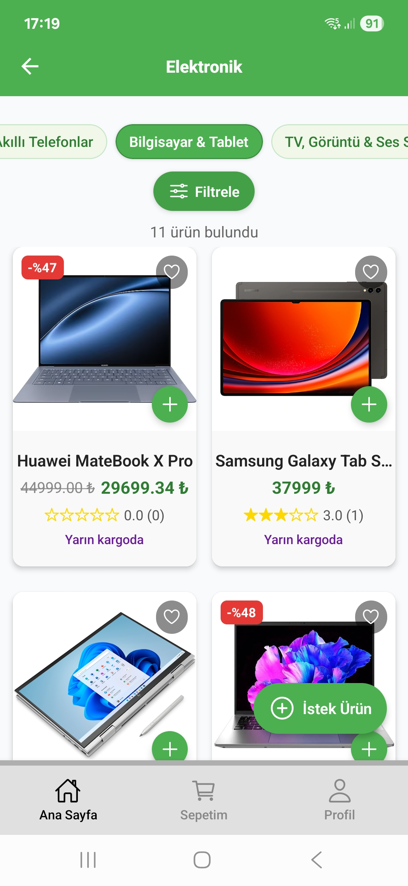
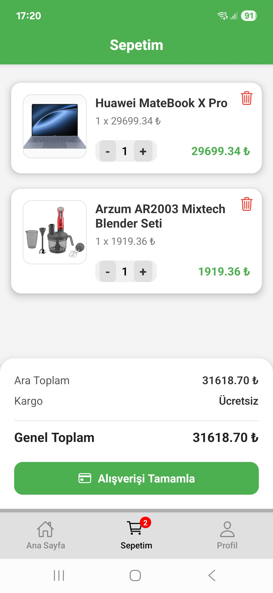
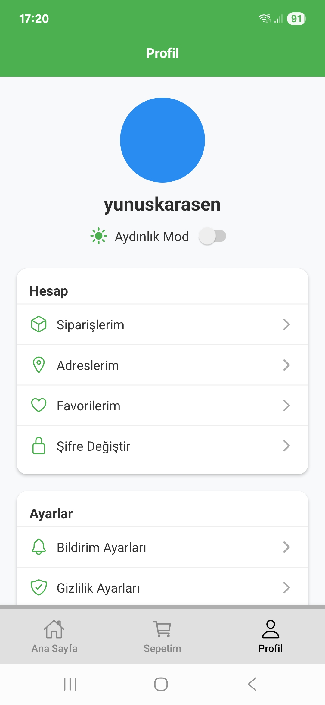
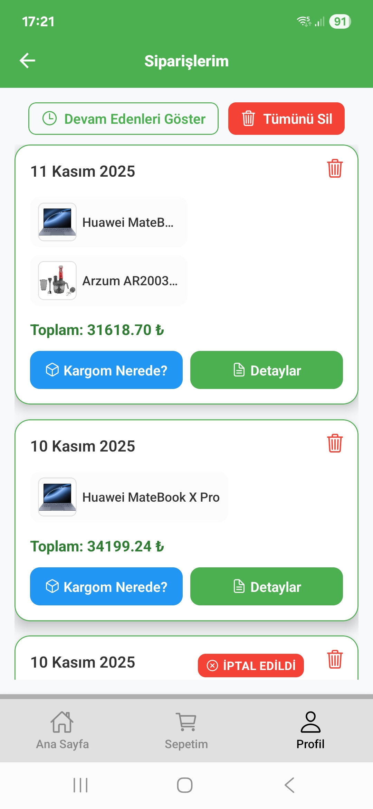
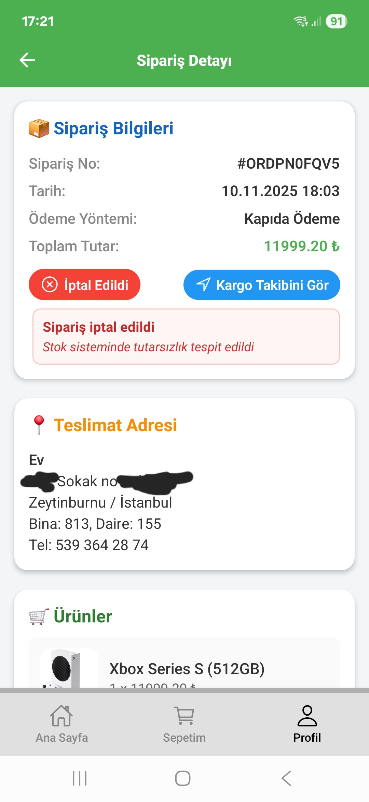
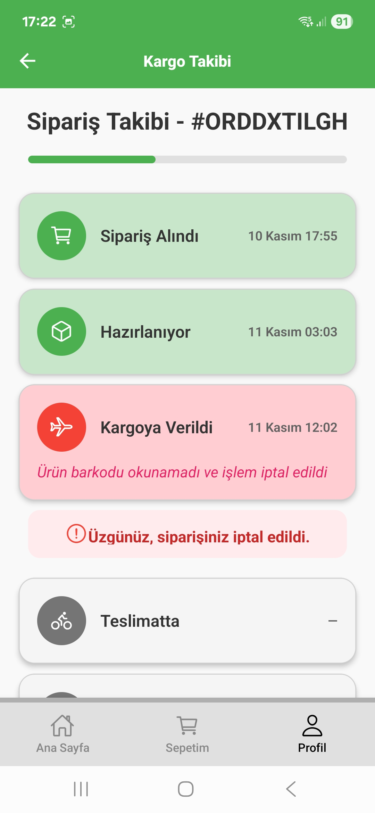
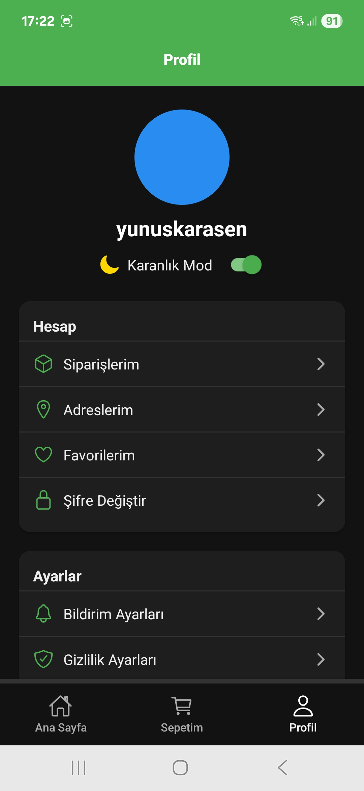

# 🛍️ FakeShopApp – Alışveriş Simülasyonu (Full Stack E-Ticaret Uygulaması)

(React Native + AWS Lambda + RDS + S3)
FakeShopApp, **React Native (Expo)** ve **Node.js (Express + MySQL)** kullanılarak geliştirilmiş modern bir **mobil e-ticaret simülasyonu** projesidir.  
Kullanıcılar ürünleri inceleyebilir, sepete ekleyebilir, sipariş verebilir, kargo takibini görüntüleyebilir ve geri bildirim gönderebilir.  
Tamamen **backend bağlantılı, dinamik, karanlık mod destekli** ve **responsive tasarımlı** bir uygulamadır.

---

## 🚀 Özellikler

### 👤 Kullanıcı İşlemleri

- Kayıt olma, giriş yapma, çıkış yapma (JWT ile kimlik doğrulama)
- Profil bilgilerini düzenleme
- Şifre değiştirme
- Favori ürünleri kaydetme

### 🏠 Ürün ve Kategori Sistemi

- Gerçekçi kategori ve alt kategori yapısı (örneğin: Elektronik > Telefonlar)
- MySQL üzerinden dinamik ürün listesi
- Ürün detay ekranı
- Yorum (review) sistemi ve ortalama puan hesaplama

### 🛒 Sepet & Sipariş Sistemi

- Ürünleri sepete ekleme / çıkarma / miktar değiştirme
- Giriş yapmadan sepette tutma
- Sipariş oluşturma
- Sipariş adımlarını canlı olarak takip etme
- Otomatik kargo süreci simülasyonu

### 💸 Kampanya & İndirimler

- Her gün saat 03:00’te otomatik kampanya oluşturan **cron job**
- Ürünlerde indirim yüzdesi ve süreli kampanya göstergesi

### 💬 Geri Bildirim & İstek Gönderme

- Kullanıcılar ürün veya sistem hakkında geri bildirim gönderebilir
- Lottie animasyonlu başarılı gönderim ekranı

### 🌓 Tema

- **Karanlık / Aydınlık mod** (otomatik veya elle değiştirilebilir)

---

## 🚀 Yeni Mimari: DigitalOcean → AWS Migration

Bu proje önceden DigitalOcean üzerinde çalışan Node.js Express API kullanan bir yapıdaydı.
Sistem tamamen yeniden tasarlanarak AWS Serverless mimarisine taşındı:

- AWS Lambda – Backend fonksiyonları
- Amazon API Gateway – HTTP endpointler
- Amazon RDS (MySQL) – Veritabanı
- Amazon S3 – Ürün görselleri
- IAM – Güvenli erişim yönetimi

Bu değişiklikler ile:

- Sunucu maliyetleri %90+ azaldı
- API artık tamamen ölçeklenebilir
- Static image sistemi S3’e taşındı
- Backend tarafında normalizeImages otomatik düzeltici ile eski shopapi URL’leri tamamen temizlendi
- Tüm yeni siparişler artık AWS S3 URL’leri ile kaydediliyor
- Veritabanındaki eski URL'ler REPLACE ile düzenlendi

## 🧱 Kullanılan Teknolojiler

### 🖥️ Frontend – React Native (Expo)

- React Native + TypeScript
- Expo Router
- AsyncStorage
- Context API
- Lottie Animations
- Ionicons
- Expo EAS Build (APK üretimi)

---

### ⚙️ Backend – AWS Serverless

_(DigitalOcean → AWS migration sonrası)_

#### ✔️ AWS Lambda

REST API fonksiyonları artık tamamen Lambda üzerinde çalışıyor.

#### ✔️ AWS API Gateway

Tüm HTTP endpoint'ler buradan yönetiliyor:  
**https://gdu2vdhta8.execute-api.eu-west-2.amazonaws.com**

#### ✔️ AWS RDS (MySQL)

- orders, users, products, reviews, feedbacks, addresses…
- Bağlantı havuzu (pool) yapılandırıldı
- Soğuk başlangıç (cold start) optimizasyonu uygulandı

#### ✔️ AWS S3

- Tüm ürün görselleri AWS S3 üzerinde barındırılıyor
- `normalizeImages()` ile ürün görsel yolları otomatik olarak S3 formatına dönüştürülüyor
- Eski domain ( **shopapi.yunuskarasen.com** ) tamamen kaldırıldı

#### ✔️ AWS CloudWatch

- Sipariş ilerleme simülasyonu logları
- Lambda hata takibi
- Performans metrikleri

### 🗄️ Veritabanı

- MySQL 8+
- Tam normalize edilmiş tablo yapısı (users, products, categories, orders, reviews, feedbacks, addresses)
- SQL dosyası: `fakeshop.sql`

---

## 📁 Proje Yapısı

```bash
FakeShopApp/
├── App.tsx
├── app.config.js
├── .gitignore
├── package.json
├── assets/
│   ├── icon.png
│   ├── splash-icon.png
│   ├── adaptive-icon.png
│   ├── Confetti.json
│   ├── success.json
├── components/
│   ├── ProductCard.tsx
│   ├── DeleteConfirmModal.tsx
│   ├── RequestSuccessModal.tsx
│   └── OrderSuccessModal.tsx
├── context/
│   ├── CartContext.tsx
│   └── DarkModeContext.tsx
├── navigation/
│   ├── HomeStack.tsx
│   ├── CartStack.tsx
│   └── ProfileStack.tsx
├── screens/
│   ├── HomeScreen.tsx
│   ├── CategoryProductsScreen.tsx
│   ├── SubcategoryScreen.tsx
│   ├── SepetimScreen.tsx
│   ├── CheckoutScreen.tsx
│   ├── TrackOrderScreen.tsx
│   ├── LoginScreen.tsx
│   ├── RegisterScreen.tsx
│   ├── ProfileScreen.tsx
│   └── OrdersScreen.tsx
└── backend/
    ├── server.js
    ├── config/db.js
    ├── controllers/
    ├── routes/
    ├── public/
    ├── data/
    └── .env
```

---

## ⚡ Ortam Değişkenleri (.env)

```env
# Backend örnek yapı
DB_HOST=127.0.0.1
DB_USER=root
DB_PASS=your_database_password
DB_NAME=fakeshop
JWT_SECRET=your_secret_key
```

---

## 🛠️ Kurulum

### 1️⃣ Backend

```bash
cd backend
npm install
npm start
```

### 2️⃣ Frontend

```bash
cd ..
npm install
npx expo start
```

> 🔗 `.env` dosyasındaki `BASE_URL` değeri backend’in IP adresine göre ayarlanmalıdır.

---

## 📦 Android APK Oluşturma

```bash
npx eas build -p android --profile preview
```

APK dosyası `eas.json` yapılandırmasına göre otomatik üretilir.  
Projede `BASE_URL` değeri `app.config.js` üzerinden dinamik olarak eklenir.

---

## 📸 Ekran Görüntüleri

<div align="center">

<table>
  <tr>
    <td></td>
    <td></td>
    <td></td>
  </tr>
  <tr>
    <td></td>
    <td></td>
    <td></td>
  </tr>
  <tr>
    <td colspan="3" align="center">
      
    </td>
  </tr>
</table>

</div>

---

## 🔒 Güvenlik Notları

- JWT token süresi otomatik kontrol edilir
- CORS yapılandırması güvenli şekilde ayarlanmıştır
- Veritabanı bağlantısı `mysql2/promise` ile havuz (pool) yapısında

---

## 🧑‍💻 Geliştirici

**Yunus – Fizikçi & Full Stack Developer**  
📧 [GitHub: fizikciyim](https://github.com/fizikciyim)

---

## 💬 Lisans

Bu proje **MIT Lisansı** altında yayınlanmıştır.  
Serbestçe inceleyebilir, öğrenebilir ve kendi projelerinde ilham olarak kullanabilirsin.
